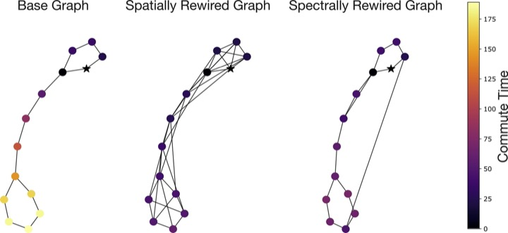
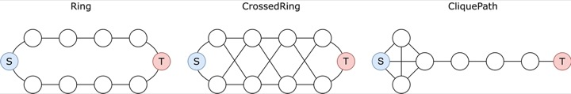
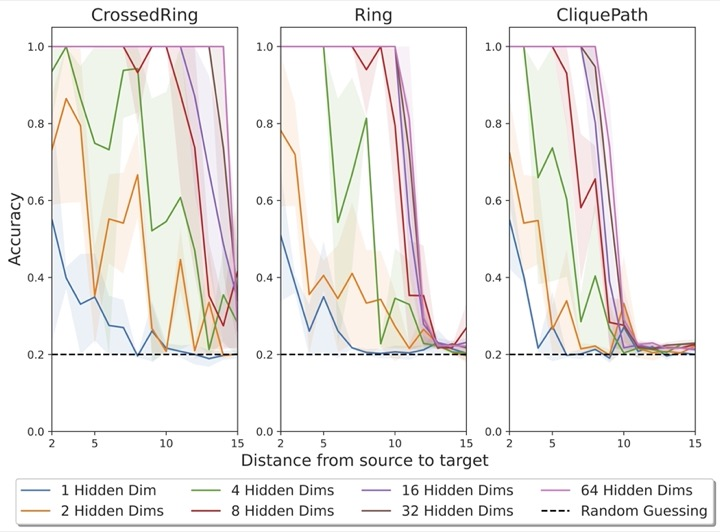
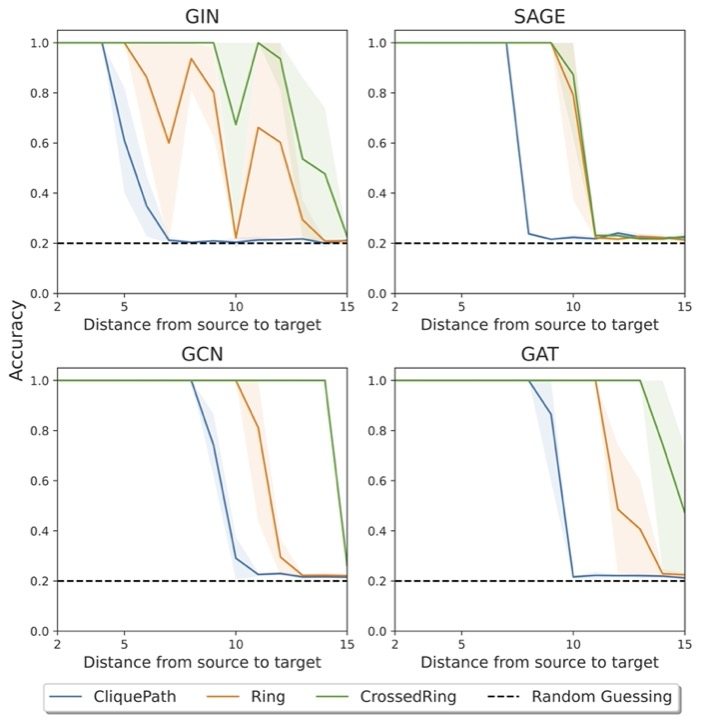
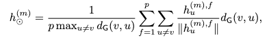

# On Over-Squashing in Message Passing Neural Networks

[](https://github.com/lrnzgiusti/on-oversquashing/blob/main/LICENSE) [](https://arxiv.org/abs/2302.02941)


This repository contains the official code used for the paper
**[On Over-Squashing in Message Passing Neural Networks: The Impact of Width, Depth, and Topology](https://arxiv.org/abs/2302.02941) (ICML 2023)**

<p align="center">
 
</p>


## Empirical Validation of Long-Range Dependencies

## The impact of width

As derived in [Theorem 3.2](https://arxiv.org/pdf/2302.02941.pdf#theorem.3.2), if a message from one node doesn't sufficiently influence a distant node -- even when the number of layers suffice to avoid underreaching --  the network is experiencing over-squashing. This implies that, in graph-based computations, information propagation becomes ineffective over long distances.


To empirically validate this theoretical result, the validation script:

```bash
bash exp/scripts/run_synthetic_hidden_dim.sh
```

evaluates a specific "graph transfer" task inspired by [Bodnar et al. (2021)](https://arxiv.org/abs/2106.12575). Given a graph with designated source and target nodes placed at distance `r` from each other:


* The target node is assigned a unique label (one-hot encoded).
* All other nodes receive a uniform feature vector.

The objective is to update the source node's feature to match that of the target. Due to over-squashing, the performance degrades as `r` (the distance between source and target) increases.


<p align="center">
 
</p>

The validation covers three distinct graph topologies: **CrossedRing**, **Ring**, and **CliquePath**. The hypothesis is that while the specific topology affects performance, for any given topology, enhancing the hidden dimension of the graph neural network should lead to improved performance, especially for larger distances `r`.


#### Insights and Observations


<p align="center">
  
</p>


The experiments employ the Graph Convolutional Network (GCN) model by [Kipf & Welling (2017)](https://arxiv.org/abs/1609.02907) across the three graph transfer tasks. Even though the number of layers is set equal to the distance between source and target (ensuring adequate depth), increasing the hidden dimension directly improves performance.

Results confirm the theorem's insights: **A higher hidden dimension can counteract the adverse effects of over-squashing, enabling the model to handle tasks with longer-range dependencies more effectively across varied graph topologies.** However, increasing the width can only help up to a limited extent -- as illustrated in the experiments -- as other problems arise when we take larger hidden dimension such as over-fitting and issues with trainability.

## The impact of depth

[Theorem 4.1](https://arxiv.org/pdf/2302.02941.pdf#theorem.4.1) highlights that when the computation depth (`m`) is on par with the graph's diameter (`diam(G)`), the issue of over-squashing becomes more prominent, especially if the task relies on the interaction of nodes `v` and `u` which are at a relatively 'large' distance `r`. In particular, we wish to validate that what 'long-range' means is strongly dependent on the underlying topology.

### Running the Validation Scripts

To empirically validate these theoretical observations, execute the following scripts:

```bash
bash exp/scripts/run_synthetic_ring_add_crosses.sh
bash exp/scripts/run_synthetic_lollipop.sh
bash exp/scripts/run_synthetic_ring.sh
```


## Specifics of the Validation

We focus on the same graph transfer tasks previously introduced - **CrossedRing**, **Ring**, and **CliquePath**. The core of this validation revolves around calculating an upper bound on the Jacobian, which gives us a tangible indication of a task's difficulty. Within these specific cases, we can further refine the right-hand side of Eq. ([4](https://arxiv.org/pdf/2302.02941.pdf#equation.4.4)) with precise values, making it easier to understand and analyze the over-squashing effect for different graph topologies.

For instance, for the GCN model:

- CrossedRing: $(S^r)_{vu} = (3/2)^{-(r-1)}$
- Ring: $(S^r)_{vu} = 2^{-(r-1)}$
- CliquePath: $(S^r)_{vu} = \frac{2^{-(r-2)}}{r\sqrt{r - 2}}$

Accordingly, we expect CrossedRing to be the 'easier' topology, while CliquePath should be the 'harder' one, meaning that the performance should deteriorate for smaller values of r on the CliquePath topology.

## Insights and Observations


<p align="center">
  
</p>


Initial results show a predictable behavior across various models including GIN ([Xu et al., 2019](https://arxiv.org/abs/1810.00826)), SAGE ([Hamilton et al., 2017](https://arxiv.org/abs/1706.02216)), GCN ([Kipf & Welling, 2017](https://arxiv.org/abs/1609.02907)), and GAT ([Veličković et al., 2018](https://arxiv.org/abs/1710.10903)). Specifically:

- CliquePath is observed to be the most challenging task.
- The Ring task follows CliquePath in difficulty.
- CrossedRing is relatively easier compared to the other two.

As expected, for some topologies a model achieves perfect accuracy while on others the same model collapses to random guessing. The message here is that what `long-range' means is highly sensitive not only with the given GNN but also, and more importantly, with the graph-topology. 

## The impact of topology

[Theorem 5.5](https://arxiv.org/pdf/2302.02941.pdf#theorem.5.5) finds a relationship between the  commute time (effective resistance) of a graph and ease of information propagation in Message Passing Neural Networks (MPNNs). 


### Experiment Details

```bash
python exp/signal_propagation.py
```

The experiment validates the correlation between the total effective resistance of a graph, $Res_G = \sum_{v,u} Res(v, u)$ ([Ellens et al., 2011](https://www.sciencedirect.com/science/article/pii/S0024379511001443)), and the efficacy of information propagation in an MPNN.

The methodology is as follows:

1. A source node $v \in V$ is chosen, and it's assigned a `p`-dimensional unitary feature vector. All other nodes are assigned zero-vectors.
2. The quantity:


<p align="center">
  
</p>


represents the amount of signal or ‘information’ that has propagated through the graph `G` by an MPNN with `m` layers.

This effectively measures the normalized propagation distance over `G`, averaged over all the `p` output channels. A larger propagation distance implies that on average, the initial **'unit mass'** has propagated further in relation to the source node.

### Objective

The experiment aims to show that $h^{(m)}_\odot$ is inversely proportional to $Res_G$. This indicates that graphs with a lower total effective resistance will have a more significant propagation distance.
This experiment is applied to each graph `G` within the dataset `D`. The steps include:

1. Randomly selecting the source node `v`.
2. Assigning $h_v$ an arbitrary feature vector with unitary mass ($h_v \|_{L_1} = 1$) and setting the zero-vector to all other nodes.
3. Using MPNNs with a layer count `m` close to the average diameter of the dataset graphs, input and hidden dimensions `p = 5`, and ReLU activations.
4. Estimating the resistance of `G` by sampling 10 nodes uniformly for each graph, and subsequently reporting $h^{(m)}_\odot$.

### Findings


<p align="center">
  
</p>


The findings indicate that MPNNs propagate information further when the effective resistance is low, providing empirical evidence of the graph topology's impact on the over-squashing phenomena. Importantly, MPNN parameters are randomly initialized, and there is no underlying training task, effectively isolating signal propagation issues from the vanishing gradient phenomenon.

## Reference

If you have found our work useful, please cite us using the bibtex entry below:
```
@inproceedings{di2023over,
  title={On over-squashing in message passing neural networks: The impact of width, depth, and topology},
  author={Di Giovanni, Francesco and Giusti, Lorenzo and Barbero, Federico and Luise, Giulia and Lio, Pietro and Bronstein, Michael M},
  booktitle={International Conference on Machine Learning},
  pages={7865--7885},
  year={2023},
  organization={PMLR}
}
```
